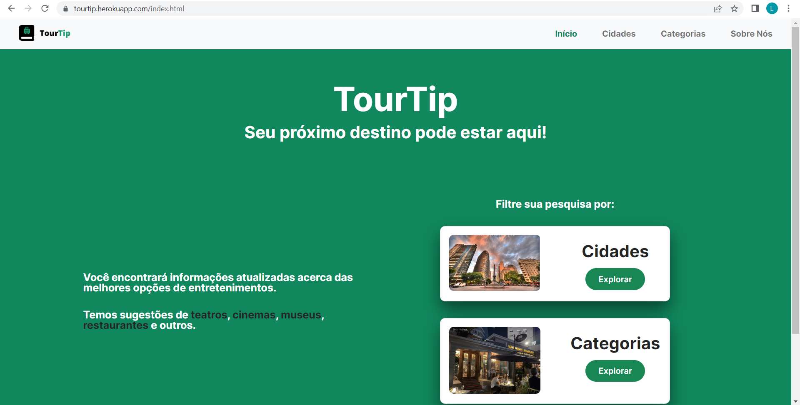
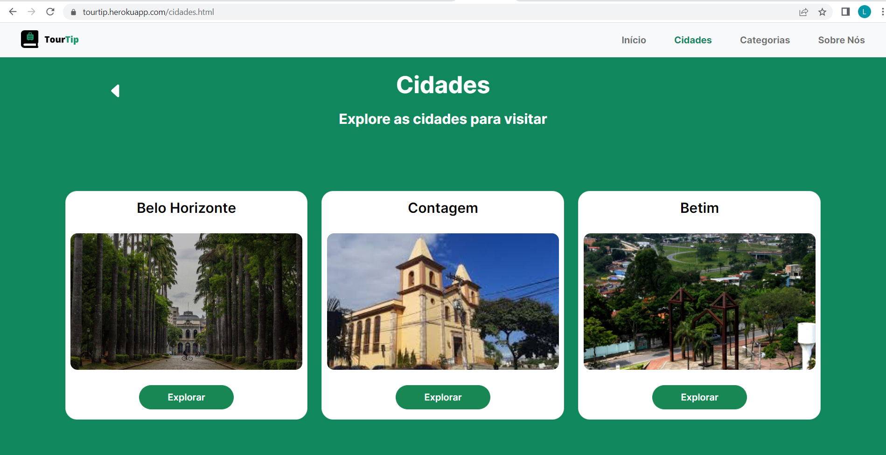
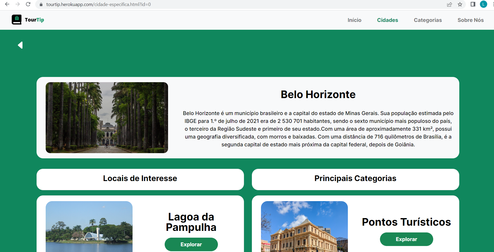
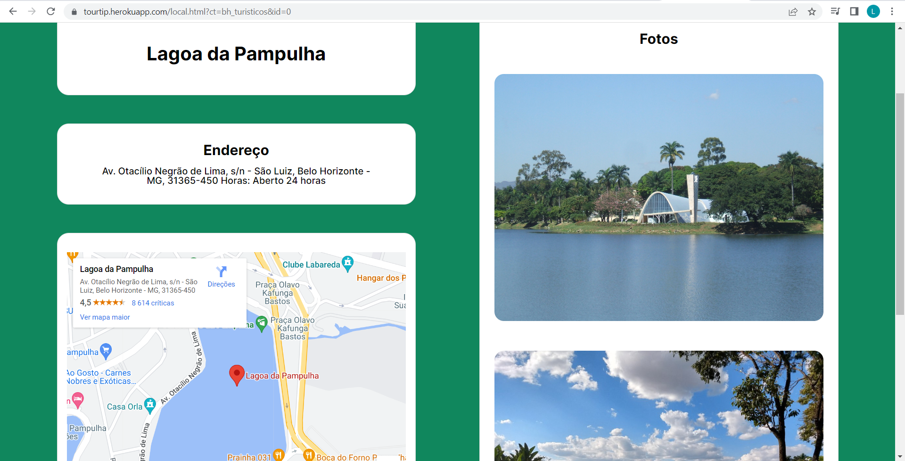
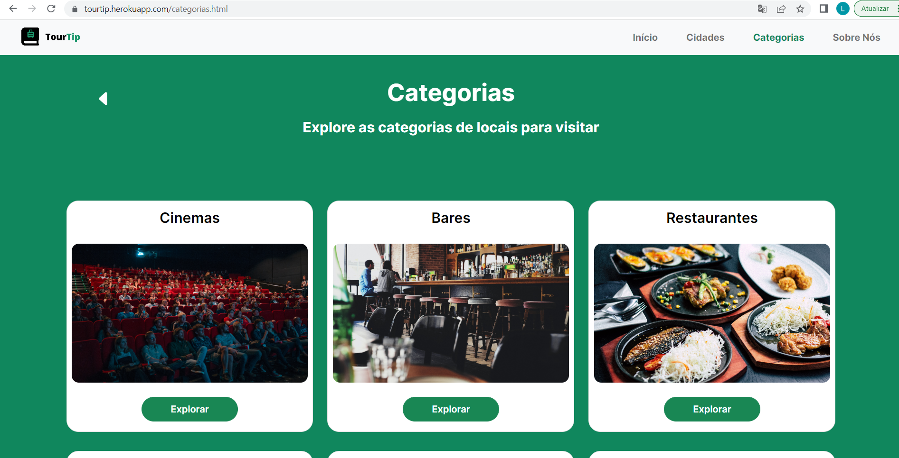
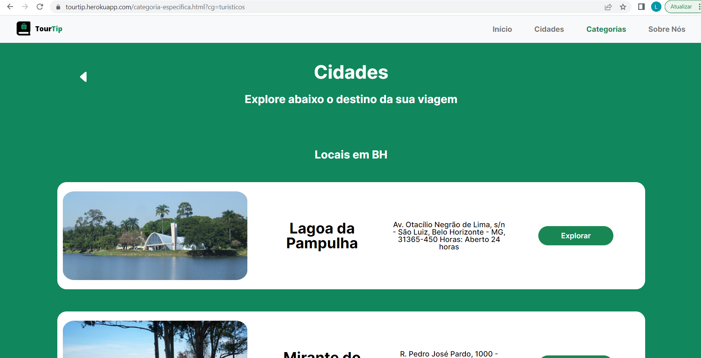
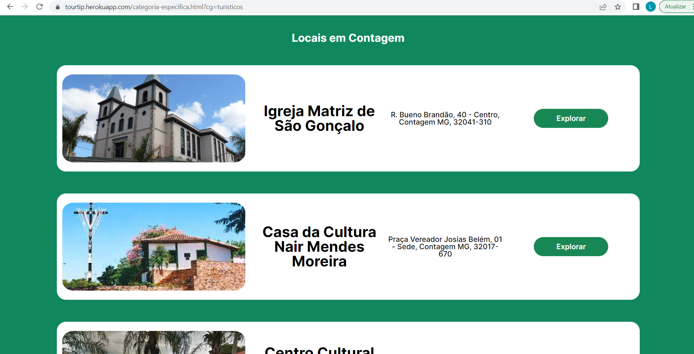
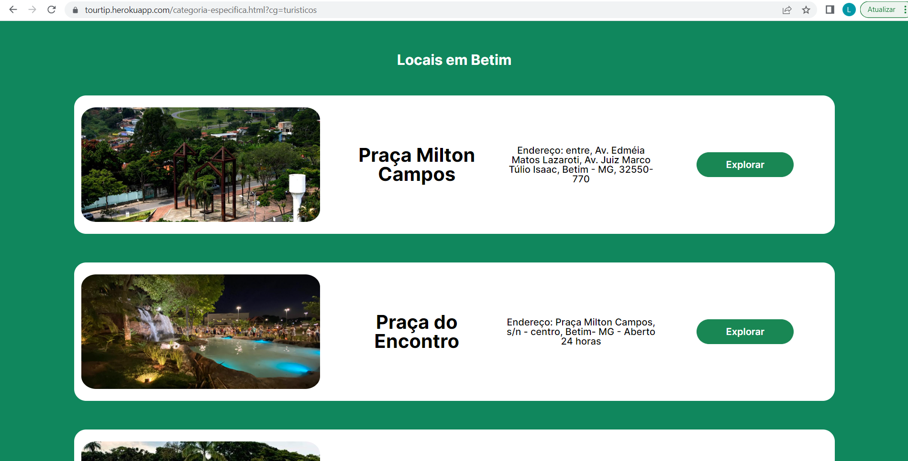
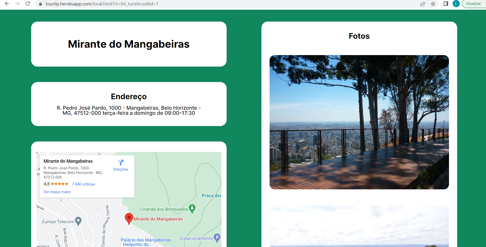
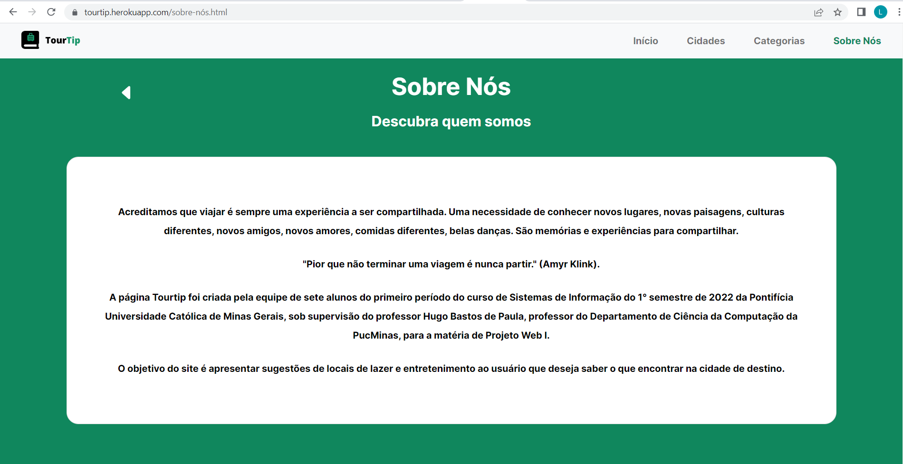

 

# Programação de Funcionalidades

Neste documento estão descritos os artefatos e estrutura de dados criados para atingir os requisitos funcionais e não funcionais que foi previsto nas <a href="./specification.md">Especificações do Projeto</a>, também deve possuir as instruções para acesso e verificação da implementação. As tecnologias usadas foram basicamente, HTML, CSS, Arquivos JSON, NodeJs, JavaScript e Heroku.

### Requisitos 
 * RF-001 - Possuir dados estáticos que não necessitem de interações constantes com bancos de dados para serem acessados.
 * RF-002 - Possuir fácil acesso a links com localizações dos locais.
 * RF-003 - Possuir um carregamento de mapas dinâmicos para cada local.
 * RF-004 - Possuir opção de expandir as informações para maiores detalhes. 

 

 ## Tela Inicial   
  A página trás uma descrição geral do site, explicando um pouco do que o navegador irá encontrar. Esta pagina atinge o requisito      * RF-004

  Para atender o requisito RF-004, a pagína inicial pode explorar tanto o assunto de Cidades, quanto o de Categorias.

  

  Nesta página, foi desenvolvido dois acessos, direcionando a novas paginas, mais especificas sobre o assunto.

 

## Cidades
  Ao  clicar para explorar "Cidades", aparecerá o seguinte menu:

  

  Nesta página, encontra-se três cidades para aprofundar-se nas pesquisas, sendo estas:
   * Contagem
   * Belo Horizonte
   * Betim
   
 

#### Belo Horizonte
  Ao ser direcionado para a página de BH, aparecerá uma rápida descrição da cidade em um box. Um pouco mais em baixo, aparecerá uma lista de Locais de Interesse e outra de Principais Categorias.

  

  Aparecerão diversos destinos nestas listas para se aprofundar, vamos pegar como exemplo a Lagoa da Pampulha.
 

##### Lagoa da Pampulha
  Ao ser aberta a pagina, aparecerá diversas informações sobre o local. Com essa página, atinginmos os requisitos: 
 * RF-002
 * RF-003

 

  Este modelo final de página sobre qualquer local (bares, cinemas, parques, museus, restaurantes), de modo que por qualquer caminho percorrido, será exibida as seguintes informações:
   * Nome do Local
   * API do Local
   * Link
   * Endereço  
   * Fotos
 

## Categorias
  Ao ser direcionado a página de categorias, a partir do menu inicial, o internauta encontrará todas as categorias de locais das cidades a qual o site propõe disponibilizar.

 

  Nesta página, você pode ser direcionado para qualquer uma das categorias seguintes:
   * Cinemas
   * Bares
   * Restaurantes
   * Museus
   * Parques Públicos
   * Pontos Turisticos

  Ou você pode usar a barra de ferramentas no canto superior direito da página para escolher outro direcionamento.
 

### Pontos Turisticos 
  Ao escolher a opção de pontos turisticos na página de categorias, você será direcionado para esta página, onde encontrará todos os pontos turisticos das três cidades.

 

 

 

  A partir disto, você faz o filtro de qual cidade irá análisar, de forma que o próprio internauta faça esse filtra, visto que, aparecem as três cidades na página. A partir disso é apenas escolher o local a qual se deseja verificar maiores informações.
 

#### Mirante do Mangabeiras
  Esta é a pagina final desta sequência de filtros realizados pelo internauta. Você encontrará informações mais detalhadas sobre o local escolhido.

 
 

## Sobre Nós
  Na barra de ferramentas no canto superior direto, você pode a partir de qualquer página ser direcionado para a página "Sobre Nós", onde fazemos uma rápida descrição do motivo da criação do site e os objetivos do mesmo.

 

  Desta forma, fizemos os caminhos possíveis a se fazer dentro do site e encerramos o documento de funcionalidades da página.
   